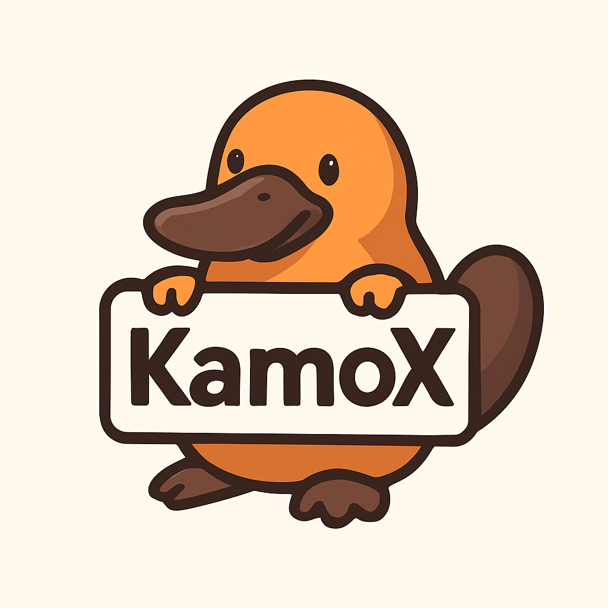

#  KamoX - Web Extension Dev Server

AIコーディングエージェントがChrome拡張機能・Electronアプリ・VSCode拡張をライブで確認しながら開発できる、プラグイン型HTTP APIサーバー。

## 特徴

- **AIフレンドリー**: HTTP API経由でビルド、UI確認、ログ取得が可能
- **プラグインアーキテクチャ**: Chrome拡張、Electron、VSCode拡張に対応（現在はChromeのみ）
- **自動化**: スクリーンショット撮影、DOM情報取得、ログ収集を自動化
- **堅牢なエラー検出**: 拡張機能のロードエラーや実行時エラーを自動検出し、ログとダッシュボードで通知
- **開発ダッシュボード**: サーバーの状態、エラー、ログをブラウザでリアルタイムに確認可能

> [!TIP]
> **For AI Agents**: 詳細なAPI利用ガイドは [docs/ai-usage.md](docs/ai-usage.md) を参照してください。

## インストール

```bash
npm install
npm run build
```

## 使い方（Chrome拡張）

1. Chrome拡張プロジェクトをビルドします（`dist`ディレクトリ等に出力）
2. KamoXサーバーを起動します：

```bash
# CLIから起動
node cli/dist/index.js chrome --project-path=/absolute/path/to/dist
```

## ダッシュボード

KamoXサーバー起動後、ブラウザで `http://localhost:3000/` にアクセスすると、以下の機能を持つダッシュボードが表示されます：

- **ステータス確認**: サーバーの稼働状況や環境情報の確認
- **エラー通知**: 拡張機能のロードエラーや実行時エラーの即時確認
- **ログ閲覧**: 直近のシステムログの確認
- **リビルド**: ワンクリックで拡張機能の再ビルドと再読み込み

## API

| Method | Path | 説明 |
|--------|------|------|
| GET | `/status` | サーバー状態確認 |
| POST | `/rebuild` | プロジェクトのリビルド |
| POST | `/check-ui` | UI表示確認（Popup等） |
| POST | `/check-script` | Content Script確認 |
| GET | `/logs` | ログ取得 |
| GET | `/` | 開発ダッシュボード |

## ライセンス

MIT
